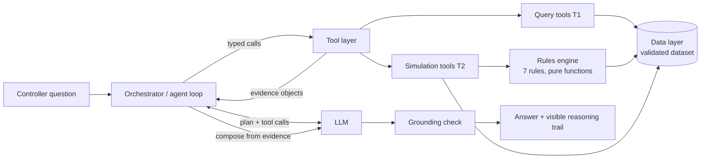
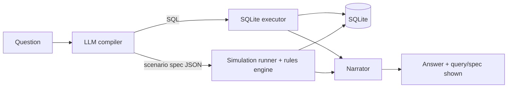
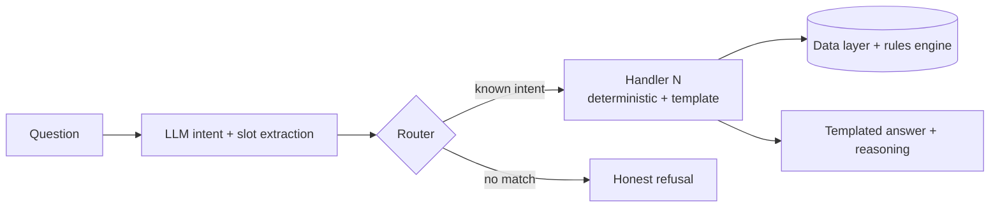
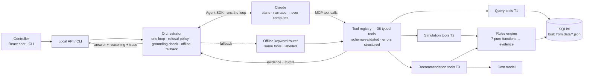

# dCortex — Crew Ops Advisor: Architecture

> Status: **ACCEPTED (2026-09-04)** — the hybrid in §5, per ADR-0003 in
> [decisions.md](decisions.md). Stack: Python · SQLite · React · provider-agnostic
> LLM client (Anthropic SDK first) · fully local (ADR-0004…0008).
>
> Scope for this document: Tier 1 (lookup) + Tier 2 (consequence/simulation).
> Tier 3 is designed-for but explicitly gated behind T1+T2 being fully functional (ADR-0001).

---

## 1. What the system must do (from the problem statement)

A controller asks a plain-language question; the system answers **correctly, fast
(seconds, not 45s), and with reasoning a controller can read and challenge**.

Hard constraints that shape the architecture:

| Constraint | Architectural consequence |
|---|---|
| Legality is exact arithmetic; approximate = violation | All rule math (FDP, 60h/7d, 100h/28d, rest, certs, base) lives in **deterministic code**, never in the LLM |
| Explainability mandatory on non-trivial answers | Computation must emit **structured evidence** (rule id, inputs, computed value, limit, margin), not just a boolean |
| Invented facts are failures; "I can't answer reliably" scores well | There must be a **first-class refusal path**, not just a happy path |
| Judged partly on held-out scenarios | The system must generalise to **unseen phrasings and parameter combinations**, not just the 38 known questions |
| Answers grounded only in the provided dataset | Single data-access layer; the LLM can never see or cite anything that didn't come from it |
| ~45s is too slow; live-shift feel | Latency budget per answer: **≤ ~8s p50**; minimise LLM round-trips |
| LLM keys "provided at venue (TBC)" | Provider-agnostic LLM client + an **offline degraded mode** as demo insurance |

## 2. Quality attributes, ranked (mapped to the judging rubric)

1. **Correctness** (Functionality 15%, scoring principle "correctness outweighs coverage")
2. **Deliberate LLM/deterministic boundary** (AI Utilization 20% — the single biggest criterion)
3. **Explainability** ("weighted throughout")
4. **Latency** (Performance 5% + UX 10% — controller under pressure)
5. **Generalisation** (held-out scenarios; Innovation 15%)
6. **Demo reliability** (live demo is a deliverable)

---

## 3. Candidate architectures

Three genuinely different answers to the central question — *"what should the LLM
do, what should deterministic code do, and how do you compose them?"* — arranged
by how much freedom the LLM gets.

### Option A — Agentic tool-calling over a deterministic ops core  ⟵ RECOMMENDED

**LLM plans and narrates; typed tools are the only way to touch data or math.**

The LLM (agent loop with function calling) receives the question plus a catalogue
of tools. Tools come in two layers, both pure deterministic Python over a single
data layer:

- **Query tools (Tier 1):** `get_reserves(station, date)`, `get_flights(filters)`,
  `get_duty_clock(crew_id)`, `get_pairing(pairing_id)`, `get_certifications(...)`, …
- **Simulation tools (Tier 2):** `simulate_crew_removal(crew_id, dates)`,
  `check_assignment_legality(crew_id, pairing_id, start_date)`,
  `station_closure_impact(station, window)`, `propagate_delay(flight_id, minutes)`, …

Every tool returns a **structured evidence object** (facts + rule verdicts with
inputs/limits/margins). The LLM composes the final answer *only* from returned
evidence; a lightweight **grounding check** verifies that numerals/IDs in the
answer appear in the evidence before it is shown. If no tool fits, the agent's
instructed move is an honest refusal.



**Worked flow (Q18):** *"If Captain C-2087 covers P-2291 from 15 Sep, does any rule breach?"*
1. LLM calls `get_pairing("P-2291")` → legs, report/release times.
2. LLM calls `check_assignment_legality("C-2087", "P-2291", "2026-09-15")`.
3. Engine computes all 7 rules; returns e.g. `{rule: RULE-DUTY-02, computed: 61.33h, limit: 60h, margin: -1.33h, verdict: BREACH, inputs: {daily_history…}}`.
4. LLM writes: "Not legal — C-2087 would breach RULE-DUTY-02 by 1h20m (61.33h vs 60h in the 7 days ending 16 Sep)…" with the evidence rendered as the visible reasoning trail.
≈ 2 LLM round-trips → seconds, not tens of seconds.

**Pros**
- Cleanest possible story for **AI Utilization**: the LLM does real reasoning (decompose, plan, chain tools, synthesise) and *provably* no arithmetic — the boundary is a typed interface you can point at in the architecture diagram.
- **Generalises**: unseen phrasings and held-out scenarios map onto the same tools; compound questions (two sick captains) become multi-tool plans without new code.
- **Explainability falls out for free** — evidence objects *are* the reasoning trail; the LLM only narrates them.
- **Extensible to Tier 3** with one new tool (`rank_options`) reusing the same legality engine — the gate to T3 is a feature add, not a rework.
- Every layer independently unit-testable; eval harness can hit tools directly (no LLM) *and* end-to-end.

**Cons**
- Agent loop = 2–4 LLM round-trips → latency needs a budget and short prompts.
- Tool-selection mistakes are possible → mitigated by few, well-named, well-described tools + eval harness + refusal instruction.
- Hard dependency on LLM API for every answer → mitigated by the offline degraded mode (Option C's router as fallback).
- Most moving parts of the three options.

**Rubric risks:** none structural; execution risk only (tool design quality, prompt discipline).

---

### Option B — NL→query compiler (text-to-SQL / query-plan generation)

**LLM translates the question into an executable artifact; deterministic executor runs it.**

Dataset loaded into SQLite. One LLM call compiles the question into SQL (Tier 1)
or a structured "scenario spec" JSON (Tier 2) that a fixed simulation runner
executes. Results summarised for the user (template or second LLM call).



**Pros**
- Single LLM call → **fastest LLM-backed option**, cheap.
- Arbitrary Tier 1 slicing/aggregation (questions we never anticipated — "longest block time", "how many captains at DEL") without writing a tool per shape.
- The generated SQL/spec is itself an inspectable artifact.

**Cons**
- **Wrong-SQL is a silent failure** — fluent, confident, wrong: exactly the failure mode the problem statement calls "worse than no answer". Validating arbitrary generated SQL is an open problem; we'd be grading the LLM's homework with more LLM.
- **Tier 2 doesn't fit SQL.** Duty-window math, FDP reduction, rest chains, reserve windows need the same deterministic simulation engine as Option A anyway — so B collapses into "A, but with a riskier Tier 1 and a schema-in-prompt to maintain".
- Explainability is weak for the target user: "here is the SQL" is not reasoning a controller can challenge (UX rubric).
- Refusal is hard to trigger — the compiler will almost always produce *some* query.

**Rubric risks:** Functionality (silent wrong answers), UX (unreadable explanations), AI Utilization (boundary is blurrier: the LLM authored the logic that ran).

---

### Option C — Intent router + parameterised deterministic handlers

**LLM only classifies and extracts slots; everything else is hand-written.**

A closed schema of ~15–20 intent families covering the known question space
(reserves-at-station, duty-headroom, flights-by-route, sick-crew-impact,
substitution-legality, closure-impact, …). One small LLM call maps the question
to `{intent, slots}`; a hand-written handler computes the answer and renders a
templated explanation. Out-of-schema → honest refusal by construction.



**Pros**
- **Maximum determinism**: same question → same answer, trivially testable, fastest (one tiny LLM call; can even run on regex offline).
- Demo-day reliability is unmatched; refusal path is built in.
- Explanations are hand-crafted per intent → consistently high quality.

**Cons**
- **Closed world.** Held-out scenarios or judge questions outside our intent list get refusals — and "answering ten correctly, refusing the eleventh" only scores well when the eleventh is genuinely unanswerable, not merely un-anticipated.
- **Weakest AI Utilization story** — the rubric literally asks "is AI solving a real reasoning problem, or decorating a lookup?" Option C is the decorated lookup.
- Compound/multi-step questions (two simultaneous sick calls, closure recovery) need bespoke handlers each; no compositionality.
- Engineering effort scales linearly with question families; multi-turn context is manual.

**Rubric risks:** AI Utilization (structural, 20%), Innovation, held-out generalisation.

---

## 4. Comparison matrix (against the actual judging rubric)

| Criterion (weight) | A: Tool agent | B: Query compiler | C: Intent router |
|---|---|---|---|
| AI Utilization (20%) | **Strong** — LLM plans/synthesises, math provably deterministic | Medium — LLM authors executable logic; boundary blurry | Weak — AI decorates a lookup |
| Innovation (15%) | **Strong** — evidence objects, grounding check, agentic composition | Medium | Weak–Medium |
| Technical Excellence (15%) | **Strong** — layered, testable | Medium — SQL validation problem | Medium — clean but rote |
| Functionality (15%) | **Strong** — T1+T2 reachable, reliable | Risky T1 (silent errors), T2 = A anyway | Strong on known Qs, brittle beyond |
| User Experience (10%) | **Strong** — readable reasoning, conversational | Weak explanations | Strong (templated) but rigid |
| Presentation (10%) | **Strong** — crisp boundary diagram | Medium | Medium |
| Business Impact (5%) | Strong | Medium | Medium |
| Scalability (5%) | **Strong** — tools scale to real data sources | Medium | Weak (handler explosion) |
| Performance (5%) | Medium (2–4 LLM calls; budgeted) | **Strong** (1 call) | **Strong** (fastest) |
| Held-out generalisation | **Strong** | Medium | Weak |
| Demo-failure risk | Medium → Low with offline fallback | Medium | **Low** |

## 5. Recommendation

**Option A — agentic tool-calling over a deterministic ops core**, hardened by
borrowing the best of the other two:

- From **C**: the honest-refusal discipline (unsupported request → structured
  "I can't answer that reliably, because…") **and** a thin offline fallback
  router over the same tools, as live-demo insurance if venue API keys fail.
- From **B**: log every tool call + evidence object as a machine-readable
  reasoning trace alongside the prose answer (audit trail = "no reasoning trail"
  pain point from the brief, and great demo material).

Option A is the only candidate that is simultaneously strong on the two things
the judges weight most (AI Utilization 20% + the correctness-first scoring
principle) *and* on the held-out generalisation test.

## 6. As built (2026-09-04)



The boundary is the MCP/tool interface: the model receives tool results and nothing else,
Claude Code's built-in tools are disabled, and every figure in the answer is checked against
the tool evidence before it is shown.

## 6a. Component responsibilities

*(Python, per ADR-0007. Storage is SQLite per ADR-0004; UI is React per ADR-0006.)*

| Component | Responsibility | Must NOT do |
|---|---|---|
| `domain/` | Typed entities (Crew, Flight, Pairing, DutyClock, Reserve, Cert…), time helpers (UTC, calendar-day windows) | I/O, LLM |
| `data/` | Build SQLite from the dataset JSONs (`loader`), hydrate typed domain objects (`repositories`); the only code that touches SQL | Business rules |
| `rules/` | The 7 rules as pure functions: `(context) → RuleVerdict{rule_id, inputs, computed, limit, margin, pass/fail, human_detail}` | I/O, LLM, ranking |
| `simulation/` | Tier-2 engines: crew removal, substitution legality, closure impact, delay propagation — compose rules, emit `Evidence` | NL parsing |
| `tools/` | Tool registry: JSON-schema tool definitions ↔ typed calls into query/simulation layers | Computation of its own |
| `agent/` | One orchestrator for two provider shapes: **loop providers** (Claude Agent SDK — runs the loop itself, our registry exposed as an in-process MCP server, ADR-0012) and **turn providers** (Anthropic Client SDK adapter, offline router — we run the loop); prompts, refusal policy, conversation state, automatic offline fallback | Arithmetic, data access except via tools |
| `explain/` | Render `Evidence` → human reasoning trail (+ machine-readable trace log) | Invent content |
| `interface/` | Local HTTP API (FastAPI) consumed by the React chat UI; CLI/REPL as dev harness (ADR-0006) | Logic |
| `evals/` | Harness: run `questions.json` (38 Qs) + `scenarios.json` keys end-to-end and per-layer; pass-rate + latency report | — |

### Tool catalogue (P1, Tier 1)
`get_snapshot`, `get_crew`, `list_crew`, `get_duty_clock`, `get_flight`, `list_flights`,
`list_routes`, `schedule_stats`, `get_pairing`, `find_pairings`, `list_reserves`,
`get_certifications`, `list_expiring_certifications`, `get_risk_signal`, `list_risk_signals`,
`get_rules`, `get_costs`. Each is a JSON-schema-validated, deterministic, read-only function
returning a JSON-ready dict; the registry turns every failure into a structured error so a tool
can never raise into the agent loop. Tier-2 simulation tools are added in P2 with `tier=2`.

### Refusal & uncertainty path (first-class)
- No suitable tool / ambiguous entity / out-of-scope date → the agent must say
  what it *can't* do and why, optionally suggesting the nearest supported question.
- Tool errors surface as "couldn't compute X" — never guessed around.
- Grounding check failure → regenerate once, then refuse. Refusals are logged and
  become the "failure case with analysis" deliverable.

### Latency budget (target p50 ≤ 8s)
- ≤ 2 LLM round-trips for T1, ≤ 3–4 for T2; short system prompt; tool results
  compact (evidence, not dumps); no streaming dependency for correctness.

## 7. Repository layout (as built)

```
dCortex/
├── README.md · Makefile (delegates) · docs/ (architecture, decisions, failure cases, deck, demo)
├── backend/                     Python project — API, engine, tools, evals, dataset
│   ├── pyproject.toml · Makefile · .env.example · .venv/
│   ├── data/ (dataset JSONs) · scripts/validate_dataset.py · evals/reports/ · var/ (SQLite, chats)
│   ├── src/crew_ops_advisor/{domain,data,rules,simulation,tools,agent,chats,explain,evals,interface}
│   └── tests/{unit,integration}
└── frontend/                    React (Vite) project — chat UI with conversations sidebar
    ├── package.json · vite.config.js · index.html
    └── src/{App.jsx, api.js, components/}
```

The two projects meet only over HTTP (`/api/*`). The backend serves `frontend/dist` at `/` for
the single-process demo; separately deployed, the frontend is a static site.

## 8. Incremental build plan (foundation → features, with exit gates)

No phase starts until the previous phase's gate is green. Tier 3 is **gated**, not scheduled.

| Phase | Build | Exit gate |
|---|---|---|
| **P0 Foundation** | domain models, loader+validation, repositories, rules engine, unit tests. **No LLM.** | All 7 rules pass hand-computed cases; dataset loads consistent with `validate.py` |
| **P1 Tier 1** | query tools, agent loop + llm_client (offline router usable without keys), CLI/REPL, eval harness | **16/16 T1 questions** pass end-to-end; p50 latency in budget |
| **P2 Tier 2** | simulation engines, evidence→explanation rendering, refusal path | **14/14 T2 questions** (or documented misses) + scenario answer keys S1–S5 reproduced |
| **P3 Hardening/UX** | React chat UI over the local API, grounding check, failure-case analysis, diagram + deck | Demo dry-run clean; latency report; deliverables checklist ticked |
| **P4 Tier 3** *(only after P2 gate)* | `rank_options` tool: candidate enumeration × legality × cost, ranked with reasoning; notification drafting | 8 T3 questions credible; S6 plan legal |

The eval harness is deliberately early (P1): the dataset ships answer keys, so we
continuously grade ourselves the same way the judges will.

**Phase status**

| Phase | Gate result |
|---|---|
| P0 Foundation | ✅ 2026-09-04 — 43 tests green; all 7 rules reproduce the answer keys (Q18/Q20/Q21/Q22/Q24/Q28 + engineered facts); whole roster evaluates legal except the flagged exception; SQLite build matches `validate.py` counts |
| P1 Tier 1 | ✅ 2026-09-04 — 16 query tools, orchestrator, **Claude Agent SDK provider (default)**, Anthropic Client-SDK adapter, offline router, `ask`/`chat`/`eval` CLI, eval harness. **Real model (Agent SDK): 16/16 Tier-1, p50 7.0 s, p95 8.7 s, est. $0.43/run** (`evals/reports/tier1-agent-sdk.md`). Offline router: 16/16, p50 < 5 ms. Tier-2 questions refused, not mis-answered. 125 tests green. |
| P2 Tier 2 | ✅ 2026-09-04 — simulation engines (crew removal, assignment legality with deadhead, station closure, delay, cancellation, near-limits, reserve coverage), 10 tier-2 tools, explanation renderer, offline Tier-2 planning. **Real model 14/14 (p50 9.7 s), offline 14/14**; scenario parity S1–S5 in tests (`evals/reports/tier2-agent-sdk.md`). |
| P3 Hardening / UX | ✅ 2026-09-04 — grounding check with one corrective retry; FastAPI + React chat UI with reasoning trail, grounding badge, fallback notice, `?q=` deep links; README (approach, trade-offs, limits, PII, scalability); `docs/failure-cases.md`; deck and demo script. |
| P4 Tier 3 | ✅ 2026-09-04 (P2 gate was green) — option ranking (candidates × rating → window → 7 rules → cost), joint plans, delay recovery, notification drafting, morning briefing; 6 tier-3 tools. **Offline 7/8, real model 4–7/8 by run (all correct on review)**; S1/S2/S4/S6 reproduced exactly, S5 and Q33 divergences documented. |

## 9. Cross-cutting commentary owed in the README (rubric credit)

- **Scalability:** how tools map onto real airline systems (roster DB, crew-tracking APIs) at 100× volume; stateless engine, swappable data layer.
- **PII/security:** synthetic today; production would need role-based access, redaction in traces/LLM payloads, audit logs, data-residency. (Earns Technical Excellence credit per brief §6.)
- **Known limits:** honest list, incl. the analysed failure case.

## 10. Decisions taken (2026-09-04) — see decisions.md for rationale

| ADR | Decision |
|---|---|
| 0003 | Hybrid architecture: Option A + refusal discipline & offline router (from C) + reasoning trace (from B) |
| 0004 | SQLite, built from `data/*.json` at startup; stdlib `sqlite3`, no ORM |
| 0005 | Provider-agnostic `llm_client`; Anthropic SDK first adapter; offline router works with no key |
| 0006 | React (Vite) chat UI over a local FastAPI; CLI/REPL as dev harness |
| 0007 | Python 3.11+ (`src/` layout) |
| 0008 | Fully local runtime |
| 0009 | Ship `data/` + validator only; organiser-internal files excluded |
| 0010 | Offline router implements the same provider contract as the model adapters |
| 0011 | Eval grading = recall of answer-key facts + human precision review |
| 0012 | LLM reasoning on the Claude Agent SDK (default); tools exposed as in-process MCP; API-key auth for the product |
| 0013 | Grounding check policy and Tier-3 heuristic ranking; documented divergences from two answer keys |
